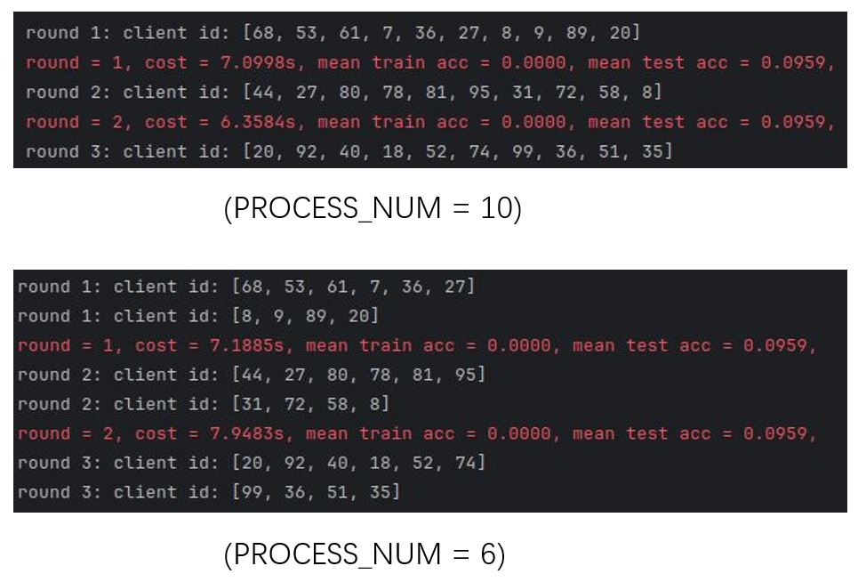

# FedLMT
This repository is for the paper:
> FedLMT: Tackling System Heterogeneity of Federated Learning via Low-Rank Model Training with Theoretical Guarantees \
> Jiahao Liu, Yipeng Zhou, Di Wu, Miao Hu, Mohsen Guizani and Quan Z. Sheng. \
> ICML 2024

The repository is built upon [FedRolex](https://github.com/AIoT-MLSys-Lab/FedRolex), where Ray, a popular distributed AI training framework, is used to speed up the experimental verification. 
 
# Usage
## Setup
``
pip install -r requirements.txt
``
## Data Partition
Three common Federated Learning (FL) data heterogeneity scenarios are built into the repository. The first one is the IID setting, and the others are the non-IID settings consisting of pathological non-IID setting (which is the same as that in this [paper](https://arxiv.org/abs/1602.05629)) and practical non-IID setting (which is the same as that in this [paper](https://arxiv.org/pdf/1909.06335)). 
Currently, we introduce 5 popular datasets: **CIFAR10, CIFAR100, SVHN, Tiny-ImageNet** and **Wikitext-2**. If you need to add your custom dataset, you can imitate our existing data processing by adding the data processing file in the ``datasets`` folder and modifying the codes in the ``data_utils.py`` file and ``functions.py`` in the ``utils`` folder. 

### Examples for CIFAR10
```
cd ./data

# for IID setting with 100 clients
python generate_cifar10.py -noniid 0 -num_users 100

# for pathological non-IID setting with 100 clients, each client only has two types of labels
python generate_cifar10.py -noniid 1 -num_users 100 -shard 2

# for practical non-IID setting with 100 clients, the degree of data heterogeneity is
# reflected by the Dirichlet distribution with a hyper-parameter alpha=0.5  
python generate_cifar10.py -noniid 2 -num_users 100 -alpha 0.5
```

## Models
For image classification tasks (CIFAR10, CIFAR100, SVHN, Tiny-ImageNet), we use **ResNet-18**. 
For natural language tasks (Wikitext-2), we use **Transformer**. 
If you want to add your custom model, just add it in the ``model`` folder and modify the codes in ``model_utils.py`` in the ``utils`` folder.

## Training
You can see the command in the ``scripts.sh`` to reproduce the main results in our paper.

### Example for CIFAR10
```
python main.py --dataset_name cifar10
  --model_name resnet18
  --control_name 1_100_0.1_noniid2-0.5_fix_a1-b1-c1_bn_0_0
  --algo_name FedLMT
  --ratio_LR 0.2
  --decom_rule 0 0
  --optimizer_name SGD
  --scheduler_name CosineAnnealingLR
  --g_rounds 2000
  --l_epoch 1
  --lr 1e-1
  --seed 31
  --B 64
  --devices 0 1
  --PROCESS_NUM 10
```
The description of most hyper-parameters can be found in ``main.py``, except for the `control_name`.

The meaning of the `control_name` is:
1_{num users}{num participating users}{iid or noniid1-{num classes} or noniid2-{ratio}}{dynamic or fix}{heterogeneity distribution}{batch norm(bn), {group norm(gn)}}{scalar 1 or 0}_{masked cross entropy, 1 or 0}. This variable is derived from [FedRolex](https://github.com/AIoT-MLSys-Lab/FedRolex) and is used to simulate the system heterogeneity and data heterogeneity in federated scenarios.

**Usage of Ray**. Another variable we want to introduce is the `PROCESS_NUM`. This variable is associated with the Ray, a distributed machine learning training framework, and controls the number of processes used for FL training. For example, assume that there are 100 clients in FL and only $10%$ of them participate in training in each round, if we set `PROCESS_NUM=10`, it means that we generate 10 processes and each process is responsible for one client's local training; 
if we set `PROCESS_NUM=6`, it means that we only generate 6 processes for clients' local training. In this time, These 10 clients will be processed by Ray into two batches, the first batch will process the first 6 clients, and the second batch will process the remaining 4 clients, as shown in the following figure. Anyway, this does not affect the final model accuracy anyway, just the time it takes to complete the training. Compared with most existing federated learning repositories, using Ray can greatly reduce the time required for simulation experiments since 
it supports multi-GPU process parallel training. Besides, People can set the number of GPU and CPU each process is allowed to 
use based on their own resources. For instance, by setting `@ray.remote(num_gpus=0.2, num_cpus=1.0)`, each process can 
use 0.2 GPU and 1 CPU. Finally, if you want to debug under the use of Ray, please set the parameter `local_mode=True` in the function `ray.init()`.




## Others
We also test the performance of the corresponding low-rank version on other widely used models (e.g., VGG, ViT, LSTM), 
and the codes can be found in [this repository](https://github.com/Sherrylife/Low-rank_Model_Training).
