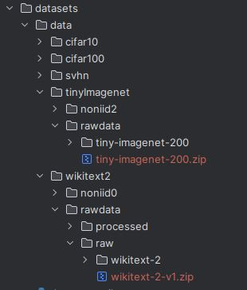

# How to generate the dataset
Most of the datasets used in this paper can be downloaded directly using Pytorch, except for WikiText2 and Tiny-ImageNet datasets.
The original address (https://s3.amazonaws.com/research.metamind.io/wikitext/) to get the WikiText2 dataset is out of work, and you can download it from this [link](https://github.com/Snail1502/dataset_d2l). 
As for the Tiny-ImageNet dataset, you can download it from this [link](http://cs231n.stanford.edu/tiny-imagenet-200.zip).
After that, create the file directory as shown in the following figure, put the raw datasets (the ".zip" file) into the corresponding folders ("./wikitext2/rawdata/raw/" and "./tinyImagenet/rawdata/"), and then 
execute the script `generate_wikitext2.py` or `generate_tinyImagenet.py` to simulate the federated non-iid settings.

 
